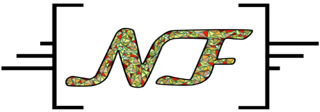
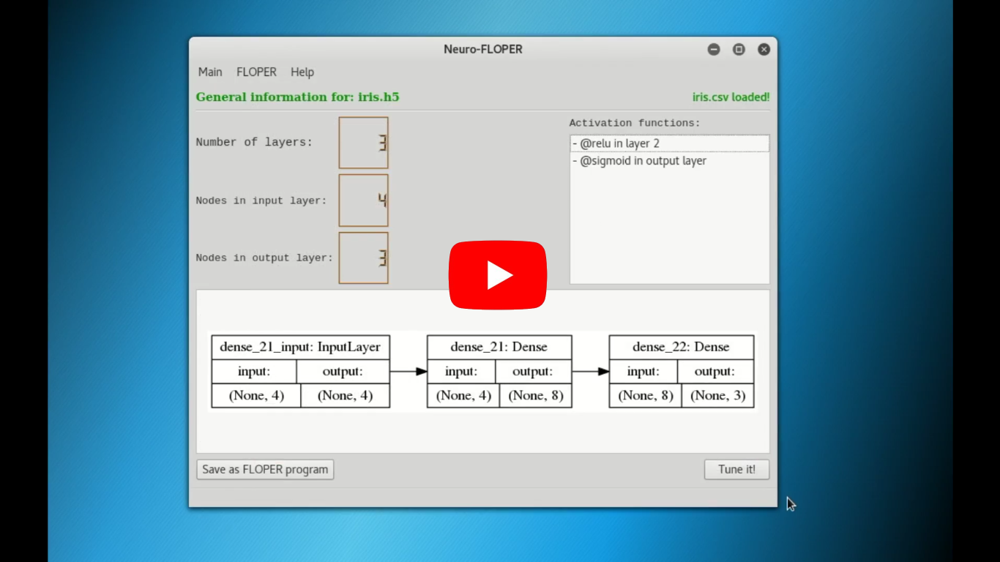

# Neuro-FLOPER

A program that allows you to translate neural networks created with Keras to fuzzy logic programs, in order to tune these networks from a given dataset. I created this tool during the development of my Final Year Project, and it wants to solve structural deficiencies created during the training process of a multilayer perceptron. This project has been developed with DEC-Tau research team.
## Prerequisites

In order to execute Neuro-FLOPER in your machine, you must have installed:
* Python 2.7
* Keras 2.1.4
* Tensorflow 1.3.0
* SWI-Prolog 6.0.2 for x86_64-linux
* PyQt4

## DOCUMENTATION

The full document of this project appears also in this repository. It corresponds to the final memory for the FYP <a href="https://github.com/Xachap/Neuro-FLOPER/blob/master/Developing%20Fuzzy%20Neural%20Networks%20With%20The%20FLOPER%20Environment.pdf">"Developing Fuzzy Neural Networks With The FLOPER Environment"</a>. Also, there is additional information in the <a href="https://biblioteca.sistedes.es/articulo/tuning-neural-networks-in-a-fuzzy-logic-programming-environment/">**paper published on SISTEDES**</a> for <a href="http://sistedes2019.spilab.es/prole/">**PROLE 2019**</a>.

A video of the basic walkthrough in Neuro-FLOPER is available on YouTube:

## About this work

 Please, cite Neuro-FLOPER as:
 
 * Moreno G., Pérez J., Riaza J.A. (2019) Fuzzy Logic Programming for Tuning Neural Networks. In: Fodor P., Montali M., Calvanese D., Roman D. (eds) Rules and Reasoning. RuleML+RR 2019. Lecture Notes in Computer Science, vol 11784. Springer, Cham
